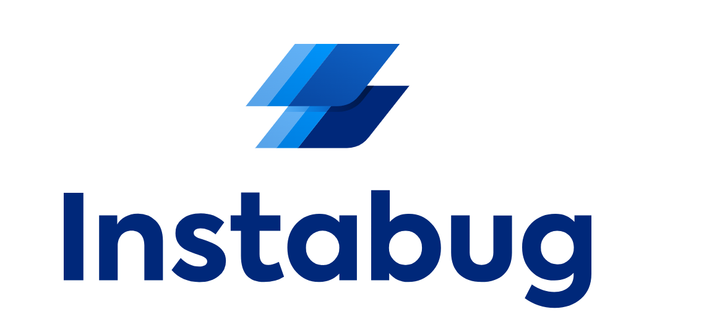

# Instabug_QC_Challenge

Project Documentation
=====================



### Maven project using TestNG, selenium with POM design pattern and Allure reporting

Overview
--------

This project contains automation for:

1. **API automation** using postman.

2. **Facebook website** using selenium, Java, and Maven.

Prerequisites
-------------

Before starting the setup, ensure the following are installed:

1. **Java Development Kit (JDK)**

    * Download and install JDK 8 or higher
      from [here](https://www.oracle.com/java/technologies/javase-jdk11-downloads.html).

    * Verify installation by running
   > * java -version

2. **Maven**

    * Download and install Apache Maven from [here](https://maven.apache.org/download.cgi).

    * After installation, verify by running:
   > * mvn -version

3. **IDE (e.g., IntelliJ IDEA or Eclipse)**

    * Install any Java IDE of your choice to work with the project.

4. **Environment Variables**

    * Add the paths of JAVA\_HOME, MAVEN\_HOME, ANDROID\_HOME, and CHROME\_DRIVER (or other drivers) to your system’s
      environment variables.

Project Setup
-------------

1. Clone the repository Clone the repository from your version control system (GitHub):

2. **Open in IDE**Open the project in your IDE of choice (IntelliJ IDEA or Eclipse).

3. In case the dependencies are not downloaded automatically,

> mvn clean install

### Key Dependencies in pom.xml

Here are some key dependencies used in this project:

1. **Run Tests**

   > 1- To Run Web tests:
   >```bash
   >mvn test -Dsurefire.suiteXmlFiles="testng.xml"
   >mvn test -Dsurefire.suiteXmlFiles="testng.xml" -DenableHeadlessExecution="yes"

   > 2- To generate allure report run the following command line:
   > ```bash
   > allure serve
   